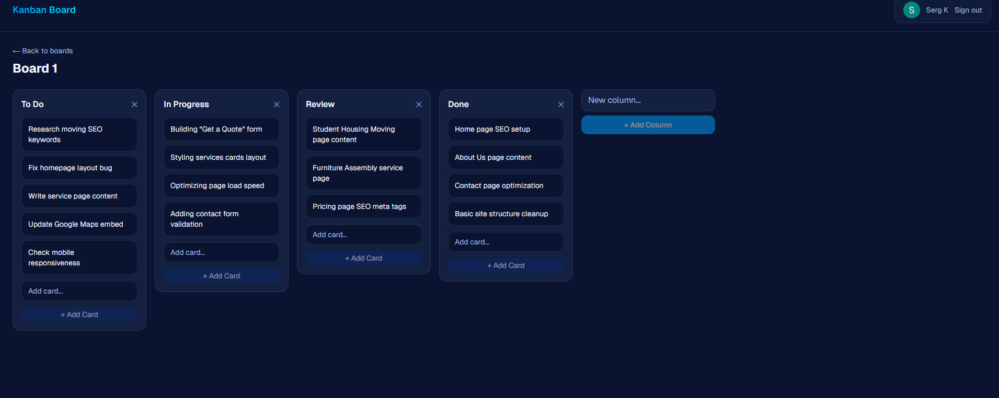

# Kanban Board

A drag-and-drop kanban board with multi-user support, persistent state, and optimistic UI.
Built with Next.js 15, TypeScript, Prisma, and dnd-kit.

**Live demo:** https://kanban-board-psi-mauve.vercel.app/

## Features

- GitHub and Google OAuth (NextAuth v5)
- Per-user boards with full CRUD
- Multi-column boards with drag-and-drop card reordering
- Optimistic UI with server-side persistence
- Inline column title editing (double-click)
- Confirmation prompts on destructive actions (delete board, delete column)
- Loading + error states for every mutation
- Drag-and-drop rollback on server failure
- Custom error fallback page (`error.tsx`)
- Mobile-responsive (horizontal scroll for columns)

## Stack

- **Framework:** Next.js 15 (App Router, server components, server actions)
- **Language:** TypeScript
- **Database:** PostgreSQL (Neon) + Prisma 7
- **Auth:** NextAuth v5
- **Drag-and-drop:** @dnd-kit/core + @dnd-kit/sortable
- **Styling:** Tailwind CSS v4
- **Deploy:** Vercel

## Local setup

\`\`\`bash
git clone https://github.com/Sergei1790/kanban-board.git
cd kanban-board
npm install
cp .env.example .env  # fill in real values
npx prisma migrate dev
npm run dev
\`\`\`

## Notes

Most interesting parts to build: dnd-kit setup, optimistic UI with rollback on server failure, ownership checks across nested resources (User → Board → Column → Card).
